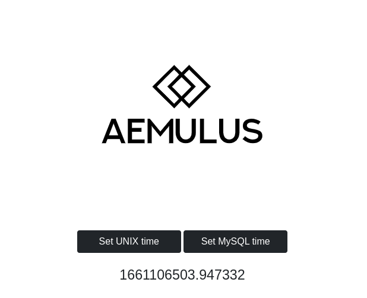

## Задание на собеседование.

Сделано на микрофреймфорке [phphleb](https://github.com/phphleb/hleb/tree/master)

---

### Что сделано

Реализован API по стандарту [JSON-RPC](https://www.jsonrpc.org/specification).

Клиентская сторона (JavaScript) представляет собой страницу с обновляющимся временем в формате UNIX timestamp или MySQL DateTime (на выбор).

Серверная сторона (PHP) обрабатывает POST-запросы с JSON содержимым и возвращает серверное время.